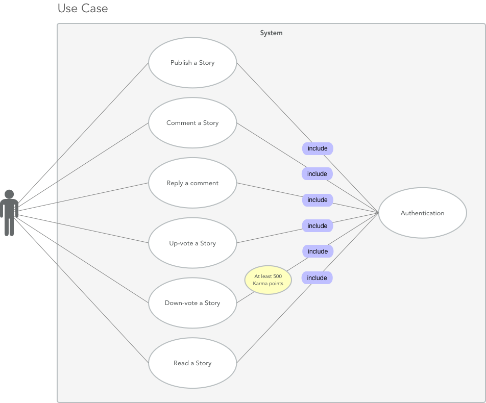

# Requirements Analysis Document For (Hacker News)

1. **Introduction**
	- A. Purpose of the system
	- B. Scope of the system
	- C. Objectives and success criteria of the project
	- D. Definitions, acronyms, and abbreviations
	- E. References
	- F. Overview

2. **Current system**

3. **Proposed system**
	- A. Overview
	- B. Functional requirements
	- C. Nonfunctional requirements
		- a. Usability
		- b. Reliability
		- c. Performance
		- d. Supportability
		- e. Implementation
		- f. Interface
		- g. Packaging
		- h. Legal

	- D. Systemmodels
		- a. Scenarios
		- b. Use case model

4. **Glossary**

---

### 1. Introduction
In this section we will try to establish the essentials, for the system and an lead-in to what some of the most fundamental functionality that has to be present in the system. 

##### A. Purpose of the system
To enable discussions and opinions for users by letting them create stories, which others may comment on, and if they choose to, up-vote/down-vote. 
Another important part of the system is users can use an API that we have build, to post a specific storie from their website, an again people will be able to comment on these specific stories.  

##### B. Scope of the system
The scope of the system is making sure that we have all the requirements done and implemented, and also to make sure that it is a clone of the current system. We will also need a database, for where there can be stored data. 

There will also be an API where a user can use the API to post whatever stories the user wants to post. A server is needed where the database and the API will be located, so the public can access it. 

We have an idea about, that there will an _buffer mechanism_ between our system and the simulator, the reason for that is if the system we have build goes down for some reason and there some sort of transaction going with some important data then that can be stored, and as soon as the system has the right state the transaction will be successful.

There will be no changes in the front-end/design, meaning that the design of the front-end will be exactly be the same as the current front-end. 

##### C. Objectives and success criteria of the project
__Objectives__&__Success Criteria__  -  is to develop a clear understanding at a high-level how functionality is performed in the current system (HackerNews). This also includes an understanding of the various use case scenarios and what functionality is required to complete each use case. “Leverage the information that is already available from HackerNews”. One very important objective is that team members are working together and, there is an continouous communication so that there is provided trust between developers, concerns to be addressed, and ideas to be discussed. 

A documented inventory of current requirements and functionality including non-functional requirements. It also important that there is an functioning team, where the level of productivity is high, therefore there are rolles giving to each member of the team and these roles has to be taken very seriously. The team work is a key factor to get the project up and running. 

Because of the tight scheduling and , we have made a team contract to ensure that everybody meets on time and every deadline is meet, if these team requirements are not respected there will consequences. In worst case scenario the individuel will be thrown out of the group.  

##### D. Definitions, acronyms, and abbreviations
| Acronyms     | Definitions |
| ---      | ---       |
| FAQ | Frequently Asked Questions         |
|DMCA     | Digital Millennium Copyright Act|        |
|API     | Application Programming Interface|        |

##### E. References
<<<<<<< HEAD
[Scope of the system](http://www.testablerequirements.com/testablerequirements/def_sys_scope_bound.htm)

[Hacker News](https://news.ycombinator.com)

[Usability](https://www.usability.gov/how-to-and-tools/methods/usability-testing.html)

[Reliability](https://en.wikipedia.org/wiki/Reliability_engineering)

[Performance](https://www.slideshare.net/ianmcdonald/non-functional-performance-requirements-v01)

[Performance](http://istqbexamcertification.com/what-is-non-functional-testing-testing-of-software-product-characteristics/)

[Supportability](https://en.wikipedia.org/wiki/Serviceability_(computer))
=======
* [Hacker News](https://news.ycombinator.com)
* [Testablerequirements](http://www.testablerequirements.com/testablerequirements/def_sys_scope_bound.htm)
>>>>>>> 2f1f23605ee073a52aabf332a2d83b92b34f9b9d

##### F. Overview
*Mangler*

---

### 2. Current system
The current system enables registered users to perform a variety of actions.
* Post stories
* Comment on existing stories
* Up/down vote stories
																*Description of the current system*
Hacker News is a news forum, where you can publish and read stories from other websites. The stories and comments on Hacker News can only be published by registered users.
Registered users can also up and down vote stories on Hacker News, however it's required to have at least 500 Karma points before user can down-vote stories. Karma points is calculated using up-votes, which came from other users. All down-votes from users can be marked as SPAM.

As an additional service Hacker News also comes with an API, which gives users free read access.

---

### 3. Proposed system
The proposed system is an exact clone of the current, meaning that it is the exact same functionality and design.  

##### A. Overview
The proposed system provides the same functionality as the current system, with minor improvements such as design and usability.

##### B. Functional requirements
1. Register – People have an option to register themselves as users.
2. Post stories – Registered users have the option to post stories.
3. Comments – Allows registered users, to write comments on stories, and other’s comments.
4. Vote – Registered users may up-vote published stories and comments. Once 500 karma points have been accumulated, the user is allowed to down-vote content.
5. Karma points – Karma points are calculated as the number of up-votes a given user's content has received minus the number of down-votes.
6. Spam – Regardless of karma, all users have the option to flag submitted content as spam.
7. Front-end overview of number of comments.  
8. Front-end Overview of stories. 
9. Front-end who is the author of the story.
10. Front-end overview of the blog website.
11. Rest-API Service.
12. Job’s functionality in the nav-bar.
13. Ask’s functionality in the nav-bar.
14. Show’s functionality in the nav-bar.
15. Front-end, Amount of time a story has been online.
16. Front-end, Be able to show/hide a story.
17. Front-end, Ranking system of stories.
18. Buffering mechanism.
19. Footer Guidelines.
20. Footer FAQ.
21. Footer Support.
22. Footer Security. 
23. Footer Lists. 
24. Footer Bookmarklet.
25. Footer DMCA. 
26. Footer Apply to YC. 
27. Footer Contact. 
28. Search bar, to search content on the website.
29. Forgot password functionality. 

##### C. Nonfunctional requirements

###### a. Usability
The usability is more has to be more or less the same as the current system. Meaning that the button convention should be the same, and the responds time(in milliseconds) for the buttons should be the same, etc. _Usability testing_ would be an effeicient way to ensure that our system works as the current system. 

###### b. Reliability
We are ensuring that there is no data loss, if the system for some reason is down. We will plant an _buffer mechanism_, between the system and the simulator ensuring that there will not be any data loss. We can also do some functional testing, to ensure that some predictable failure or human errors is not happening, in that way the system will be more Reliable. 

###### c. Performance
The system should be able to work under stress, meaning that there should not occur any problems if the amount of users is increasing rapidly. This can be tested using JMeter, we can do whats called a stress test. Stress test could be done at stress periods, in these stress periods(months) there can special days where the system is extra busy, meaning there is extra load time. We can also compare the current system with the new system, to find out which one of them er performing best, or we can measure what part of the system is performing badly.  

###### d. Supportability
The users will have the support of an _REST-API_, to read different kind of data. The system that we are building has different kind of technical support, user will be able to read _guidelines_, _FAQ(Frequently Asked Quistions)_, _Support_, _Contact_ and a _Searchbar_. Other services we planning on making for us as a team, are different kind of documentations, this one being one of them, and a test documentation(test cases, test plans). We will be using an framework to build the system, that will be great service for us as developer.  

###### e. Implementation
In a software context, implementation is all the post-sale processes involved in operating the software properly in its live environment. The implementation process will be designed with the end user in mind, because the participation of users in the design and implementation of the system, will serve their business objectives and reflect their priorities.

We will start by negotiating a contract with a vendor with defined set of guidelines, deadlines and a payment schedule for the entire implementation process. Contract requirements will include system performance criteria, issue penalties and delays in the implementation process, documentation, training/tutorial and vendor support in case of problems when the system goes live. We may need a person with experience in project management as well as in the technical aspects of the technology, to oversee the implementation process. 

The key component to any implementation process is testing. We will gradually test the new system until it is ready to fully go live. We will be picking out glitches, shortcomings or problems of the system to further help the implementation process. After the testing phase, we will focus on educating/training users about the new system and how to use it before the system is ready to go live. When the system is about to go live, we will review/revisit the entire implementation process and verify that everything is complete. 

We will keep a close relationship with vendors to fix problems as they appear, problems such as deadlines or going over budget. 

###### f. Interface
The system will have three different interfaces:

* User interfaces - The user interface of the software shall be compatible to any browser such as Mozilla, Chrome or Internet Explorer by which user can access to the system. 

* Communication interfaces - the system shall use the HTTP protocol for communication over the internet. 

* Application Programming Interface (API) - External programs shall be able to publish posts and comments to the system. 

###### g. Packaging
*Mangler*

###### h. Legal
The system should display disclaimers, copyright and trademarks (DMCA).

##### D. Systemmodels
*Mangler*
###### a. Scenarios
*Mangler*

###### b. Use case model
