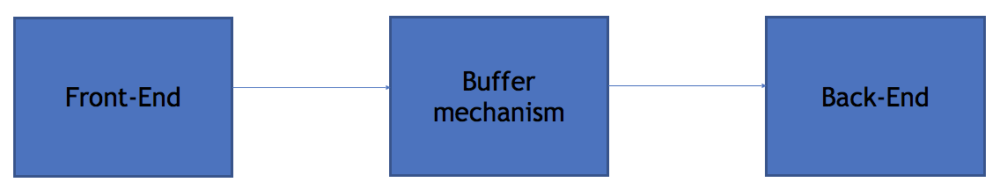
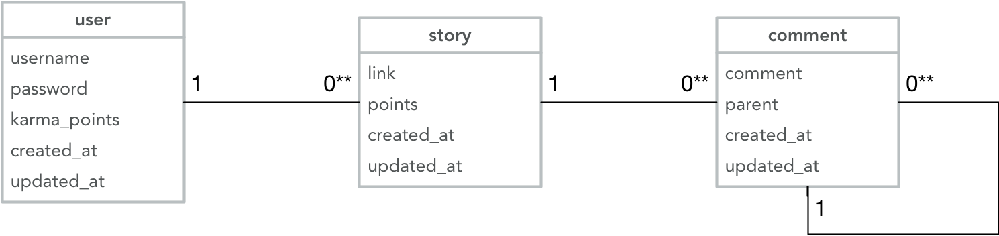
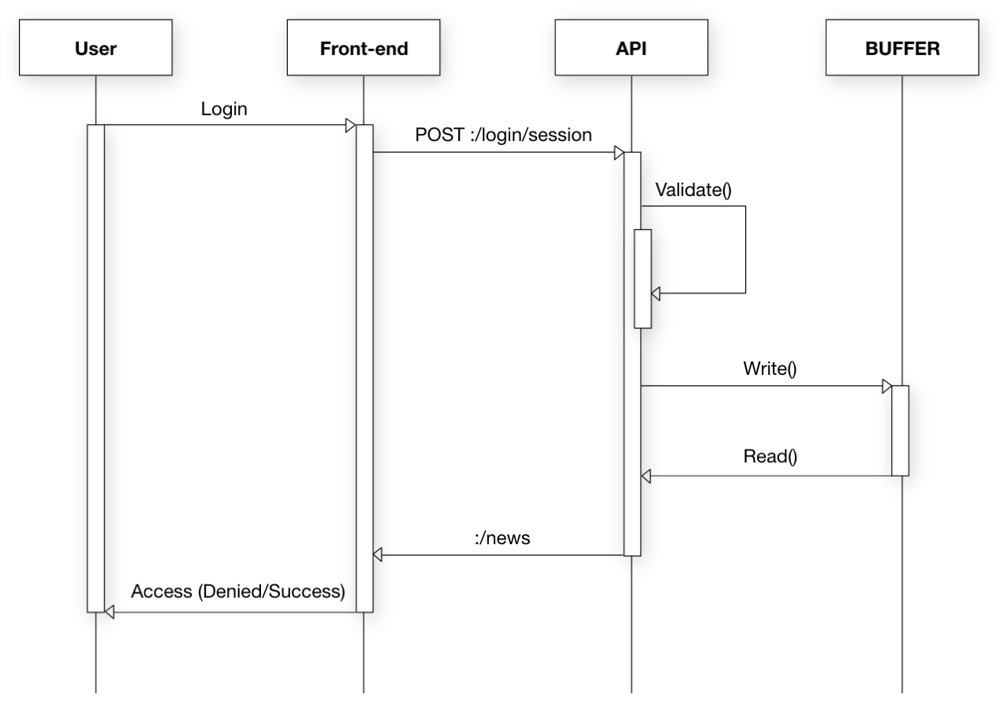
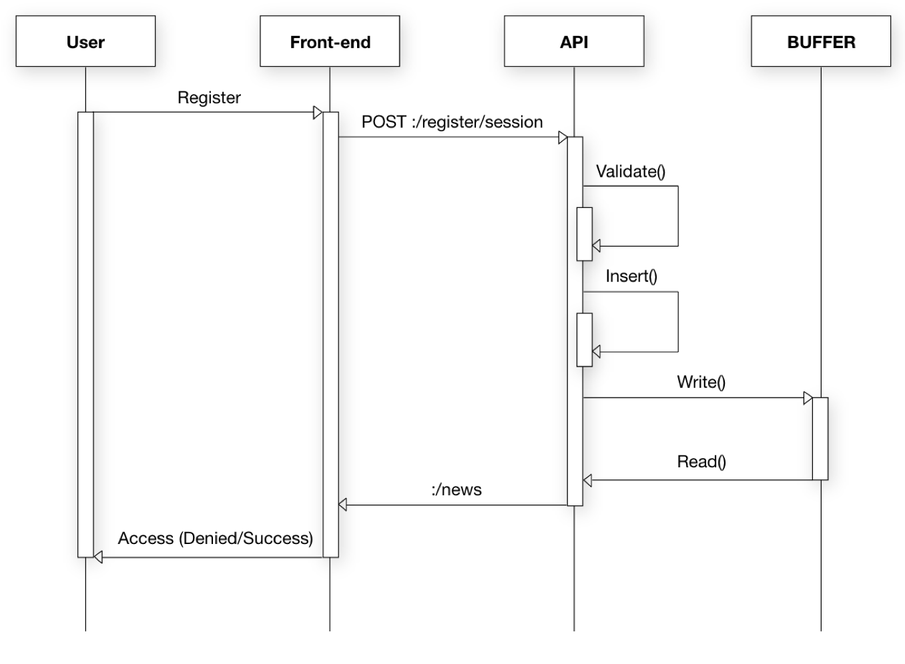
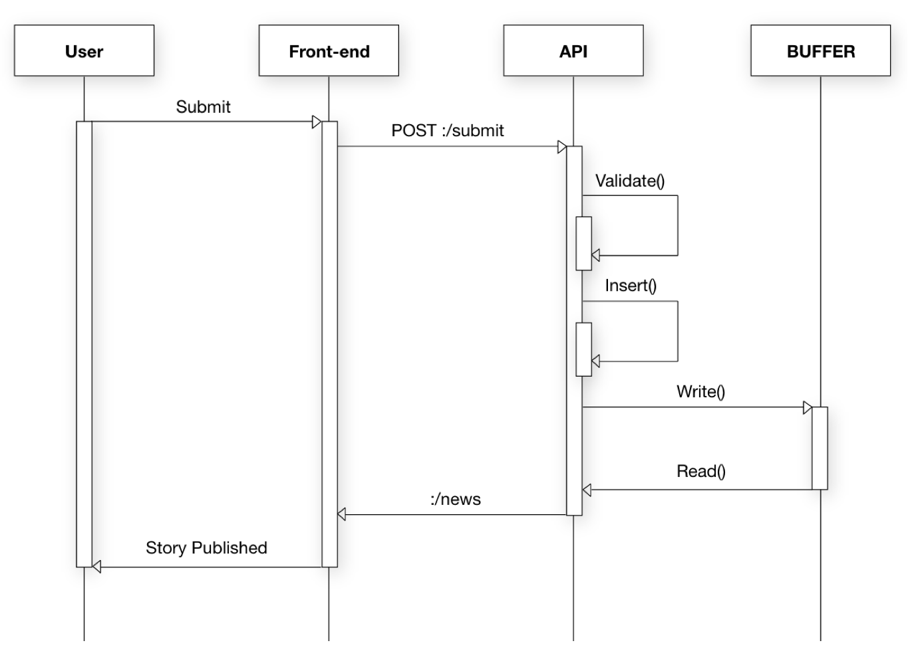
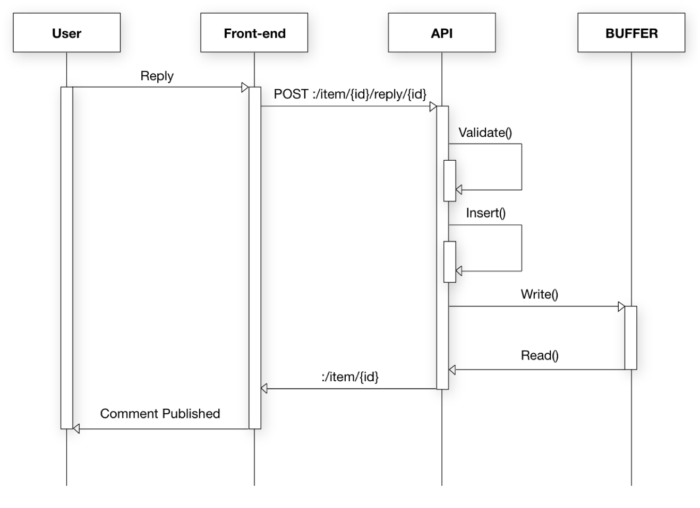
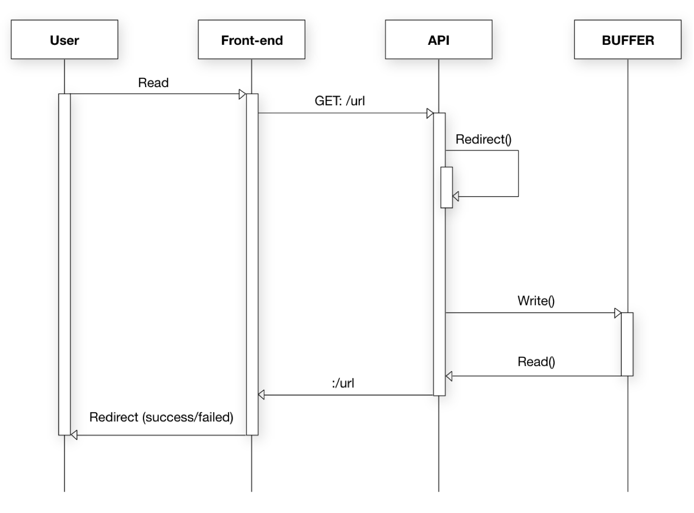
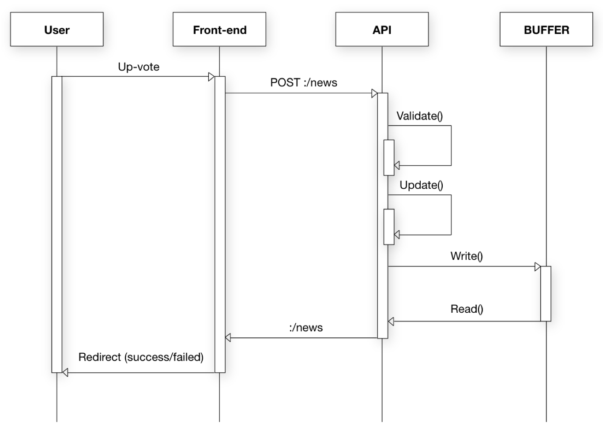
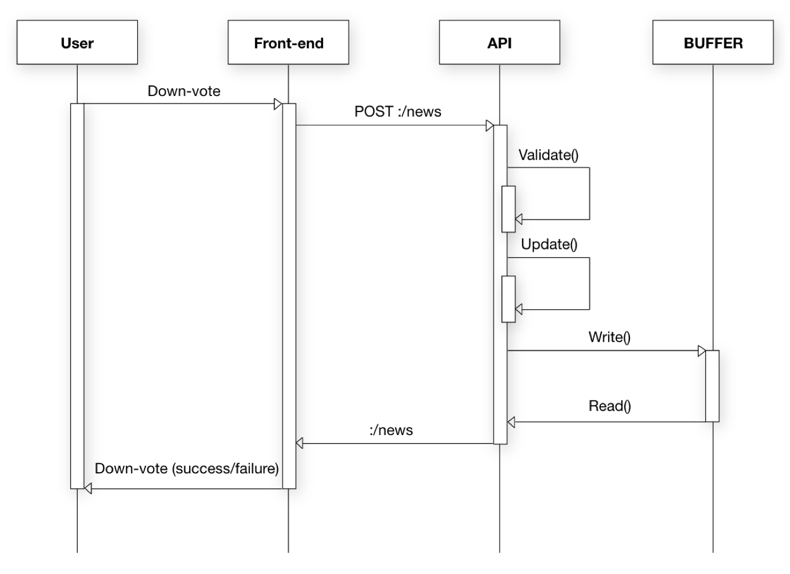
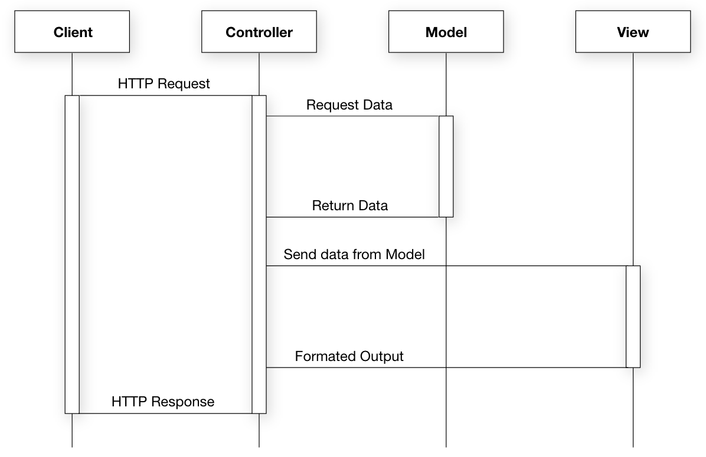

# Assignment 6 - KNA Toolbox

### 1. Divide into sub-systems
We are dividing our system into 3 sub-systems which well-defined are stand-alone software’s a front-end, back-end (including the database & API), and the buffer mechanism. In the long run this can of course change, since we are working in agile methodology. In this way, we can easily divide the work between the members of the team, which would guarantee a healthier.

The buffer mechanism activity is to store all kinds of data and watch out for if the whole hackernews system is down, then the data is safe within the buffer mechanism. The buffer mechanism takes effect only when the system is down.

---

### 2. Logical Data Model

---

### 3. Use Case Model
A fully dressed use case description

#### Login

##### Login succeed
Actor
Arnold – User (interacts with the subject)
Scenario
1. Arnold browses through the site and wants to be able to interact with other posts
2. Arnold clicks on the “Login” button in the navigation bar
3. Arnold enters username and password and clicks on the “Login” button
4. Arnold is redirected to the front page and has access to authorized functionality
5. Use case ends with Success

##### Login - Validation Failed
Arnold – User (interacts with the subject)
Scenario
1. Arnold browses through the site and wants to be able to interact with other posts
2. Arnold clicks on the “Login” button in the navigation bar
3. Arnold doesn’t enter either username or password and clicks on the “Login” button
4. Arnold receives an Error Message that says “Please fill out required fields”
5. Use case ends with Failure

##### Login – Credential Failed
Actor
Arnold – User (interacts with the subject)
Scenario
1. Arnold browses through the site and wants to be able to interact with other posts
2. Arnold clicks on the “Login” button in the navigation bar
3. Arnold enters a username and a wrong password, and clicks on the “Login” button
4. Arnold receives an Error Message that says “Username or Password incorrect, please try again”
5. Use case ends with Failure

---

#### Signup

##### Signup – Succeed
Actor
Arnold – User (interacts with the subject)
Scenario
1. Arnold browses through the site and wants to be able to interact with other posts
2. Arnold clicks on the “Login” button in the navigation bar
3. Arnold enters a username and password, and clicks on the “Create Account” button
4. Arnold is redirected to the front page and has access to authorized functionality
5. Use case ends with Success

##### Signup – Validation Failed
Actor
Arnold – User (interacts with the subject)
Scenario
1. Arnold browses through the site and wants to be able to interact with other posts
2. Arnold clicks on the “Login” button in the navigation bar
3. Arnold enters a username but doesn’t enter a password, and clicks on the “Create Account” button
4. Arnold receives an Error Message, that he needs to fill out the required fields.
5. Use case ends with Failure

##### Signup – Validation Failed (Password required length)
Actor
Arnold – User (interacts with the subject)
Scenario
1. Arnold browses through the site and wants to be able to interact with other posts
2. Arnold clicks on the “Login” button in the navigation bar
3. Arnold enters a username and enters a password less than 8 characters, and clicks on the “Create
Account” button
4. Arnold receives an Error Message, that the password must be minimum 8 characters’ long
5. Use case ends with Failure

##### Signup – Existing User
Actor
Arnold – User (interacts with the subject)
Scenario
1. Arnold browses through the site and wants to be able to interact with other posts 2. Arnold clicks on the “Login” button in the navigation bar
3. Arnold enters a username and password, and clicks on the “Create Account” button 4. Arnold receives a Message, that Arnold already has an account
5. Use case ends with Failure

##### Signup – Username Taken
Actor
Arnold – User (interacts with the subject)
Scenario
1. Arnold browses through the site and wants to be able to interact with other posts
2. Arnold clicks on the “Login” button in the navigation bar
3. Arnold enters a username and password, and clicks on the “Create Account” button
4. Arnold receives an Error Message, that the username is already taken
5. Use case ends with Failure

---

#### Comment

##### Comment Post - Validation succeed
Actor
Arnold – User (interacts with the subject)
Scenario
1. Arnold wants to comment on a post
2. Arnold navigates to the post and clicks on the “comment” button
3. Arnold enters texts and clicks on the “Add Comment” button
4. Use case ends with Success

##### Comment Post – Validation Failed
Actor
Arnold – User (interacts with the subject)
Scenario
1. Arnold wants to comment on a post
2. Arnold navigates to the post and clicks on the “comment” button
3. Arnold doesn’t enter any text, and clicks on the “Add Comment” button
4. Use case ends with Failure

##### Comment Post – Authorization Failed
Actor
Arnold – User (interacts with the subject)
Scenario
1. Arnold wants to comment on a post
2. Arnold navigates to the post and clicks on the “comment” button
3. Arnold enters text, and clicks on the “Add Comment” button
4. Arnold is not authorized
5. Use case ends with Failure

##### Up-vote Comment – Succeed
Actor
Arnold – User (interacts with the subject)
Scenario
1. Arnold wants to up-vote a comment that he likes
2. Arnold navigates to the specific comment and clicks on the “Up-vote” button
3. Arnold is informed that he has up-voted a comment
4. Use case ends with Success

##### Up-vote Comment – Authorization Failed
Actor
Arnold – User (interacts with the subject)
Scenario
1. Arnold wants to up-vote a comment that he likes
2. Arnold navigates to the specific comment and clicks on the “Up-vote” button
3. Arnold is prompted to sign up or login
4. Use case ends with Failure

##### Down-vote Comment – Succeed
Actor
Arnold – User (interacts with the subject)
Scenario
1. Arnold wants to down-vote a comment that he dislikes
2. Arnold navigates to the specific comment and clicks on the “Down-vote” button
3. Arnold is informed that he has down-voted a comment
4. Use case ends with Success

##### Down-vote Comment – Authorization Failed
Actor
Arnold – User (interacts with the subject)
Scenario
1. Arnold wants to down-vote a comment that he dislikes
2. Arnold navigates to the specific comment and clicks on the “Down-vote” button
3. Arnold is prompted to sign up or login
4. Use case ends with Failure

---

#### Post

##### Create Post – Validation Succeed
Actor
Arnold – User (interacts with the subject)
Scenario
6. Arnold wants to create a post
7. Arnold clicks on the “submit” button on the front page
8. Arnold enters a title, url and text
9. Arnold clicks on the “submit” button to make his post public
10. Use case ends with Success

##### Create Post - Validation Failed
Actor
Arnold – User (interacts with the subject)
Scenario
1. Arnold wants to create a post
2. Arnold clicks on the “submit” button on the front page
3. Arnold does not enter required fields
4. Arnold click on the “submit” button
5. Arnold receive an Error (“Please try again”), required fields cannot be empty
6. Use case ends with Failure

##### Create Post - Authentication Failed
Actor
Arnold – User (interacts with the subject)
Scenario
1. Arnold wants to create a post
2. Arnold clicks on the “submit” button on the front page
3. Arnold is prompted to log in or create a new user
4. Use case ends with Failure

---

#### A sub-system sequence diagram for all identified scenarios in the use-cases

##### Login - Substystem Sequence Diagram
* Name - Login
* Scope - System under design (SuD)
* Level - Goal: login to account
* Primary Actor - User
* Precondition - User is already registered
* Main success scenario 
	+ 1 User navigates to site
    + 2 System shows “home” page
    + 3 User clicks on “login” in navigation bar
    + 4 System shows “login” page
    + 5 User enters username and password and clicks on submit
    + 6 System authenticates user and shows “home” page
* Success guarantees - the user is authenticated
* Extensions - none
* Special Requirements – none 

---

##### Register - Subsystem Sequence Diagram
* Name - Register
* Scope - System under design (SuD)
* Level - Goal: register account
* Primary Actor - User
* Precondition - User is not already registered
* Main success scenario 
	+ 1 User navigates to site
	+ 2 System shows “home” page
	+ 3 User clicks on “register” in navigation bar
	+ 4 System shows “register” page
	+ 5 User enters username and password and clicks on submit
	+ 6 System validates entered details and shows “home” page
* Success guarantees - the user is registered 
* Extensions - none
* Special Requirements – none

---

##### Publish a story - Subsystem Sequence Diagram
* Name - Publish a Story 
* Scope - System under design (SuD)
* Level - Goal: publish a story
* Primary Actor - User
* Precondition - User is authorized
* Main success scenario 
	+ 1 User navigates to site
	+ 2 System shows “home” page
	+ 3 User clicks on “submit” in navigation bar
	+ 4 System shows “submit” page
	+ 5 User enters required fields and clicks on submit
	+ 6 System validates entered details and shows “home” page
* Success guarantees - the user published a story
* Extensions - none
* Special Requirements – none

---

##### Comment a story - Subsystem Sequence Diagram
* Name - Comment a Story 
* Scope - System under design (SuD)
* Level - Goal: comment a story
* Primary Actor - User
* Precondition - User is authorized
* Main success scenario 
	+ 1 User navigates to site
	+ 2 System shows “home” page
	+ 3 User clicks on “comments” under a post
	+ 4 System shows “post” page
	+ 5 User enters required fields and clicks on add comment
	* System validates entered details and shows “home” page
* Success guarantees - the user commented on a story
* Extensions - none
* Special Requirements – none

---

##### Reply a comment - Subsystem Sequence Diagram
* Name - Reply a comment 
* Scope - System under design (SuD)
* Level - Goal: reply a comment
* Primary Actor - User
* Precondition - User is authorized
* Main success scenario 
	+ 1 User navigates to site
	+ 2 System shows “home” page
	+ 3 User clicks on “comments” under a post
	+ 4 System shows “post” page
	+ 5 User clicks on “reply” under a comment
	+ 6 System shows “reply” page
	+ 7 User enters required fields and clicks on reply
	+ 8 System validates entered details and shows “post” page
* Success guarantees - the user replied a comment
* Extensions - none
* Special Requirements – none

---

##### Read a story - Subsystem Sequence Diagram
* Name – Read a story
* Scope - System under design (SuD)
* Level - Goal: read a story
* Primary Actor - User
* Precondition - none
* Main success scenario 
	+ 1 User navigates to site
	+ 2 System shows “home” page
	+ 3 User clicks on a story
	+ 4 System redirects to story url
* Success guarantees - the user redirected to story url
* Extensions - none
* Special Requirements – redirect requires url

---

##### Up-vote a story - Subsystem Sequence Diagram
* Name – Up-vote a story
* Scope - System under design (SuD)
* Level - Goal: up-vote a story
* Primary Actor - User
* Precondition - user is authorized
* Main success scenario 
	+ 1 User navigates to site
	+ 2 System shows “home” page
	+ 3 User clicks on up-vote button 
	+ 4 System adds a points to the story
* Success guarantees - the user up-voted a story
* Extensions - none
* Special Requirements – none

---

##### Down-vote a story - Subsystem Sequence Diagram
* Name – Down-vote a story
* Scope - System under design (SuD)
* Level - Goal: down-vote a story
* Primary Actor - User
* Precondition – user is authorized and story has at least 500 karma points 
* Main success scenario 
	+ 1 User navigates to site
	+ 2 System shows “home” page
	+ 3 User clicks on down-vote button 
	+ 4 System removes a point from story
* Success guarantees - the user down-voted a story
* Extensions - none
* Special Requirements – none

---

##### Communication Sequence Diagram
