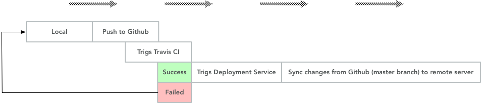

# Continuous CI and CD Documentation

MVP Application: [http://165.227.136.184](http://165.227.136.184)

---

Because we are going to use the language PHP with the Laravel 5 framework, it was obvious to use  **Laravel Forge** tool for Continuous Deployment, and **Travis CI** for Continuous Integration.

**Laravel Forge:** The reason why we are using forge, is because forge is especially build for Laravel continuous deployment. 
You can think of Laravel Forge as, administration UI on top of in our case Digital Ocean. Where we not required to learn server administration skills, laravel forge automates deployment! It's important to note that laravel forge does not provide the servers, it's a UI that simplyfies the tasks. 

**Here are the steps on how laravel forge was set, and how it automates everything:**

+ Register and fill the form in [Laravel Forge form](https://forge.laravel.com/auth/register)
+ Connect to github
+ Reference your **service provider**, in our case Digitalocean, provide your **client id** and **API key** you can get them from Digitalocean. 
+ Choose **name**, **serversize** etc. In Laravel Forge.
+ Fill your github repo. 
+ Now the project your want deploy using Laravel Forge **git clone** that project so you have it locally. The same project from the previous step. 
+ Enable quick deploy.
+ Now change something in your project, to see the magic happen. 
+ Now, **git add**, **git commit**, & **git push**. 
+ You can now witness it has been deployed! Easy!

You could also deploy your changes manually. By doing an SSH to your server and run a git pull. Or just click **deploy now** button.       

**Travis CI:** With the help of Travis, we do continuous test for our application and trig our deployment service.    

**Envoyer:** Envoyer is a **zero-down-time deployer** for Laravel, generely for PHP.   

**The CD chain steps:**

 - Push to master branch on Github.
 - Travis CI trigs the push and runs the tests.
 - Then Forge is trigged by Travis CI and deploy the changes to the remote server.

 ---

